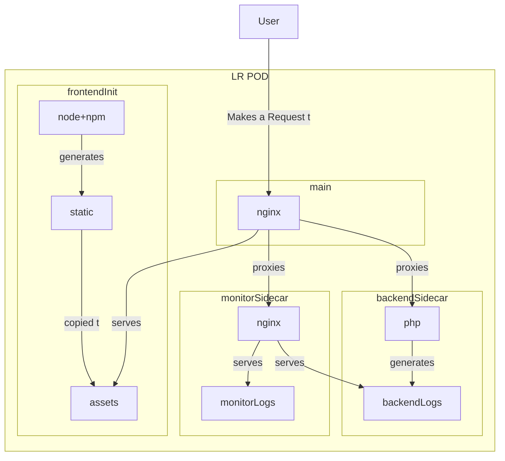

# demo-pod
An example of 4 grouped services:

```mermaid
flowchart TD
    User--Makes a Request to-->main

    subgraph LR POD
        subgraph LR backendService[backendSidecar]
            backendPHP[php]
            backendPHP--generates-->backendLogs
        end
        subgraph LR monitorService[monitorSidecar]
            monitorNginx[nginx]
            monitorNginx--serves-->monitorLogs
            monitorNginx--serves-->backendLogs
        end
        subgraph LR frontendService[frontendInit]
            frontendNPM[node+npm]
            frontendStatic[static]
            frontendAssets[assets]
            frontendNPM--generates-->frontendStatic
            frontendStatic--copied to-->frontendAssets
        end

        subgraph LR mainService[main]
            main[nginx]

            main--proxies-->monitorNginx
            main--proxies-->backendPHP
            main--serves-->frontendAssets
        end
    end
```

## Thanks to
- https://favicon.io/emoji-favicons/rabbit/
- https://github.com/twbs/bootstrap
